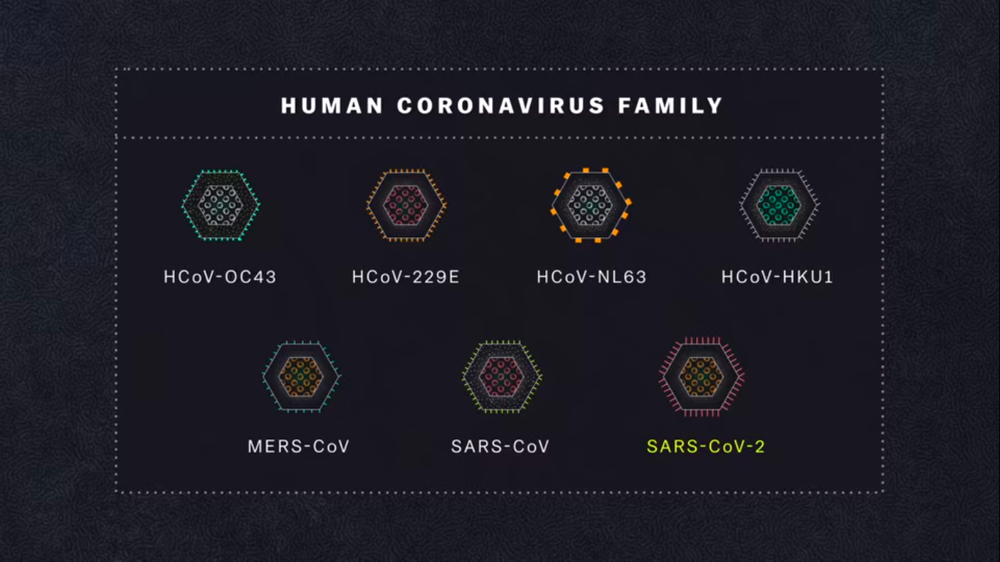

A repository for [IoT challenge](https://hackerspace.govhack.org/challenges/data_driven_iot_insights_for_sustainable_communities) as part of [GovHack2020](https://hackerspace.govhack.org/)  
### Team: Augurs  
### Challenge: [Data Driven IoT Insights for sustainable communities](https://hackerspace.govhack.org/challenges/data_driven_iot_insights_for_sustainable_communities)   

Ideas:- 
- parking made easy
- TinyML edge computing and blockchain  
- Using IoTs in hospitals...ICUs to know vacancies or iot per patient and unique id being generated and connected to an app so that doctors and family members can have info about vitals of the patient,likewise abilityt to record patient's info.  
- Likewise with pharmacies and connected to one app.  
- Install devices in factories where chemicals are made like recent lebanon accident and check for meteorological factors like temperature of room and automatically 
  alert relevant authorities.  
- Also use to prevent bushfires.  
- To be prepared for pandemics like corona
  - there are about 1.5M viruses in the pandemic we are unaware about, preventing zoonotic virus like covid19.  
  - For decades zoonotic viruses are causing outbreaks with no vaccines for treatement.  
    Ex: SARSCOV2002 and MERS2012 coronaviruses, that killed in 100s.   
  - And then there is epidemic like covid-19 caused by the SARS-CoV-2 virus, which occured almost after a century and has killed in 1000s.    
    covid-19 is the disease.SARS-CoV-2  is the virus.  
  - There are 7 types of coronaviruses known among which SARS-CoV and MERS-CoV are detrimental than HCoV  
  
